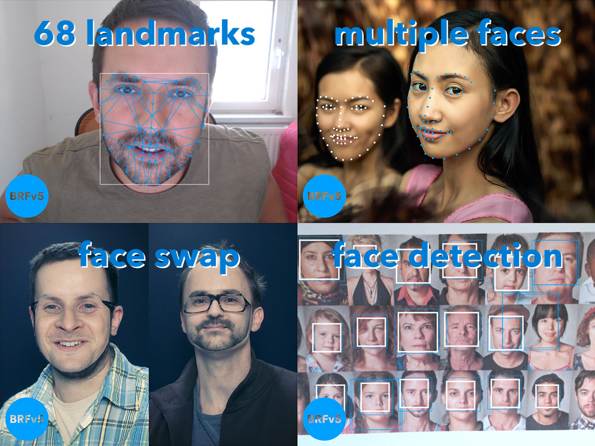
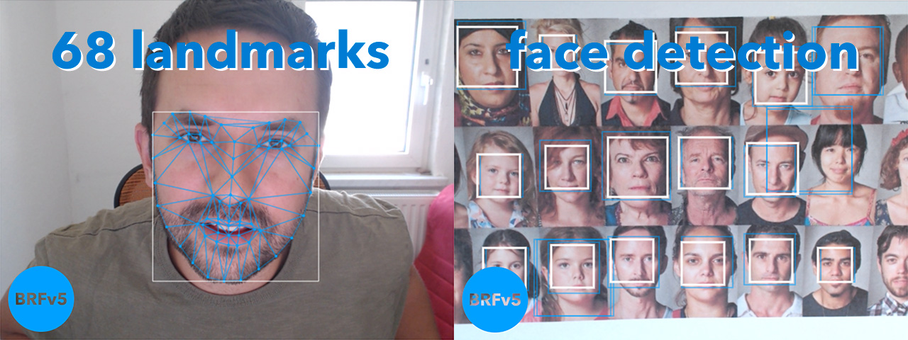

# Beyond Reality Face SDK - v5.1.0 (BRFv5) - Platform: Browser

### What is BRFv5?

It is a real-time face detection and face tracking SDK. It analyses image data 
(eg. a camera stream, video stream or a static image) and returns facial landmarks 
and data to place 3d objects on a face.



### Ready to try!

Read the EULA (eula.txt) carefully before using the trial SDK. 
You can try and test the trial SDK free of charge. Before you buy a license, please test 
the SDK thoroughly to see if it meets the requirements of your project. Once you decide to 
use BRFv5 commercially, please contact us by email. You will receive a separate license 
agreement, which you must agree to. 

+ http://www.tastenkunst.com/#/contact

### Visit us online.

+ [GitHub (all repos)](https://github.com/Tastenkunst)
+ [BRFv5 Demo (platform: browser)](https://tastenkunst.github.io/brfv5-browser/)
+ [ARTOv5 - Augmented Reality Try-On based on BRFv5](https://artov5.com/)
+ [TPPTv5 - ThreeJS Post Processing Tool for ARTOv5](https://artov5.com/tpptv5/)
+ [Docs / API](https://tastenkunst.github.io/brfv5-docs/)
+ [Website](https://www.beyond-reality-face.com)
+ [Facebook](https://www.facebook.com/BeyondRealityFace)
+ [Twitter](https://twitter.com/tastenkunst)

### BRFv5 - Getting started.

To test BRFv5 simply visit the JavaScript demo site:

+ https://tastenkunst.github.io/brfv5-browser/

Or download this repository from GitHub and run the index.html on a local server.

### ARTOv5 - Getting started.

If you are looking to implement an Augmented Reality Try-On, that places 3d objects
on to of the face, we got you covered. Try the demo here:

+ https://artov5.com/

It's a Vue.js based web component, can be plugged into any website and is
easily configurable.
 
See artov5/artov5_static/js/artov5_api.js for what's configurable.

ARTOv5 is available for paying customers.

Also available is TPPTv5 - ThreeJS Post Processing Tool for ARTOv5.

+ https://artov5.com/tpptv5/

It allows you to load 3D models into the ThreeJS editor, place them correctly on a 3D head and
export those models for ARTOv5. You can also conveniently try on your model within the editor.

### Which platforms does BRFv5 support?

#### HTML5/Browser – JavaScript (works in Chrome/Firefox/Edge 16/Opera/Safari 11)
Run the index.html on a local server.

#### iOS - ObjectiveC/C++ (To be Released later in 2019)
Open the Xcode project. Attach your actual iOS device and run the example app on your device 
(examples need the device camera).

#### Android - Java (To be Released later in 2019)
Open the Android Studio project. Attach your Android device and run the example app on your device
(examples need the device camera).

#### macOS - C++ utilizing OpenCV for camera access and drawing (To be Released later in 2019)
Have [OpenCV](http://opencv.org/) brewed (opencv3) on your system. Open the Xcode project and just run it on your Mac.

#### Windows - C++ utilizing OpenCV for camera access and drawing (To be Released later in 2019)
Good luck in trying to compile [OpenCV](http://opencv.org/) for your Windows. 
Update the Visual Studio (2017) project properties that mention OpenCV.
Then run the Release x64 target. Fingers crossed!

#### Adobe AIR - ActionScript 3 on Windows, macOS, iOS and Android (To maybe Released later in 2019)
Use your preferred IDE. Add the src folder and the ANE itself to your class path and run the example class on your 
desired device (not in a simulator).

### Technical overview

BRFv5 comes with the following components:

+ Face Detection - finds faces (rectangles) in image data (camera stream, video or still image)
+ Face Tracking - finds 68 facial landmarks/features




All available platform-specific packages have approximately the same content 
and come with a number of examples to demonstrate the use of the SDK.

### What image data size does BRFv5 need?

You can input any image size.

Internally BRFv5 uses a XYZx480 (landscape) or 480xXYZ (portrait) image for the analysis. 
480px is the base size that every other input size gets scaled to, eg.

landscape:

+  640 x  480 -> 640 x 480 // fastest, no scaling
+ 1280 x  720 -> 854 x 480
+ 1920 x 1080 -> 854 x 480

portrait:

+  480 x  640 -> 480 x 640 // fastest, no scaling
+  720 x 1280 -> 480 x 854
+ 1080 x 1920 -> 480 x 854

BRFv5 scales the results up again, so you don't have to do that yourself.
All parameters named *size or *width are pixel values based on the actual image size.
eg. telling BRF what face sizes to initially detect:

If you work with a 640x480 camera stream, it would be something like this:
```javascript
brfv5Config.faceDetectionConfig.minFaceSize = 144
```
Where as if you work with a 1280x720 camera stream, you will need something like this:
```javascript
brfv5Config.faceDetectionConfig.minFaceSize = 144 * (720 / 480)
```
A common factor for the image base size might come in handy:
```javascript
const inputSize  = Math.min(imageWidth, imageHeight)
const sizeFactor = inputSize / 480.0
brfv5Config.faceDetectionConfig.minFaceSize = 144 * sizeFactor
```
This is implemented in the examples, just take a look at brfv5__configure.js.

### FAQ

Can I track other objects, eg. hands or neck or full body?
+ No, the library is tracking faces only.

Can you improve the performance?
+ BRFv5 has various configuration values that you can use to influence performance.
```javascript
  brfv5Config.faceTrackingConfig.numFacesToTrack
  brfv5Config.faceTrackingConfig.numTrackingPasses
  brfv5Config.faceTrackingConfig.enableStabilizer
  brfv5Config.faceTrackingConfig.enableFreeRotation
```
+ BRFv5 also comes with different models, 42 landmarks for 3d object placement and 68 landmarks for detailed analysis,
both come in a min, medium and max version. Please try those out and find the most fitting for your project.

Can you make the library smaller?
+ We put a lot of effort into making the smallest possible library. The min versions of the models are 
the smallest that don't sacrifice too much accuracy. This might not be true for your use case. 
We might be able to provide even less accurate thus smaller models, but only for commercial customers.

When will the other platforms be available.
+ We plan to work on the other example projects until the end of 2019.

### Release notes

v5.1.3 - 29th January 2020

+ Version bump for emscripten to v1.39.6 - upstream

v5.1.0 - 14th November 2019

+ BRFv5 is now 40% faster.
+ v5.1.0 are not compatible with v5.0.x.
+ Model files are not structured in chunks instead of _min, _medium, _max. Load any number of chunks from
4 to 8 chunks (lower is possible, but accuracy won't be great).

v5.0.2 - 10th November 2019

+ Version bump for emscripten to v1.39.2 - fastcomp

v5.0.1 - 11th September 2019

+ Internal restructuring of code, small fixes.

v5.0.0 - 26th August 2019

It's done! After over a year of development Tastenkunst is proud to announce the release of BRFv5.

Features:
+ Face Tracking
+ Face Detection

JavaScript Examples:
+ Single Face Tracking
+ Multi Face Tracking
+ ThreeJS 3D Object Placement
+ Image Overlay Placement
+ Texture Overlay Placement
+ Face Swap
+ Extended Face Shape Estimation (Forehead)
+ Smile Detection
+ Blink Detection
+ Yawn Detection
+ Coloring Libs

Changes from BRFv4: 
+ Smaller models: The largest model is now 5MB (instead of 9MB for BRFv4). The smallest for 3D placement is 2,5MB.
+ Rewrote the whole API to streamline configuration.
+ Removed: Point Tracking. It was rarely requested and might come as a separate library if there is demand for it.
+ Removed ASM package: WebAssembly is now widely supported.
